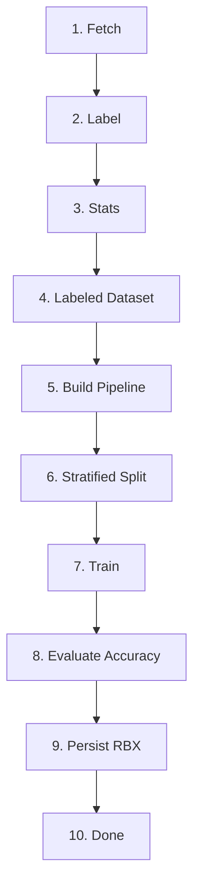
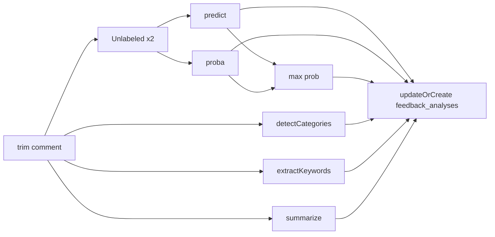
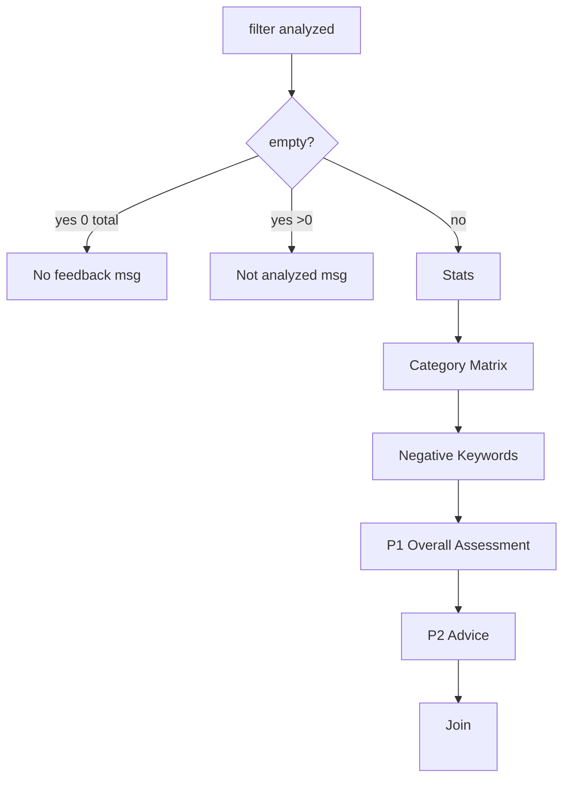
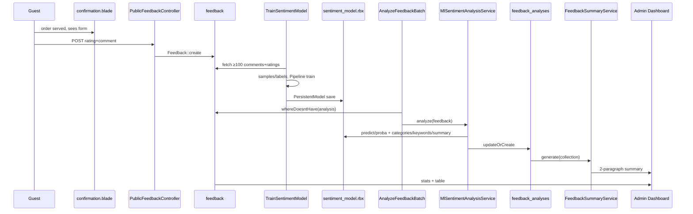

# Feedback Feature — Technical Documentation

> **Project:** `lara_my_starter` (SmartServe) — Laravel 13 + Rubix ML 2.3 + Tailwind v4 + Alpine.js
> **Last updated:** 2026-08-29
> **Scope:** End-to-end feedback lifecycle — collection, storage, model training, analysis, summary generation, and display.

---

## Table of Contents

1. [Overview & Architecture](#1-overview--architecture)
2. [Feedback Collection](#2-feedback-collection)
3. [Data Model & Storage](#3-data-model--storage)
4. [Model Training — Detailed Steps](#4-model-training--detailed-steps)
5. [Feedback Analysis — Detailed Steps](#5-feedback-analysis--detailed-steps)
6. [Summary Generation — Detailed Steps](#6-summary-generation--detailed-steps)
7. [Display & Analytics UI](#7-display--analytics-ui)
8. [APIs & Batch Processing](#8-apis--batch-processing)
9. [End-to-End Data Flow](#9-end-to-end-data-flow)
10. [Tech Stack & Dependencies](#10-tech-stack--dependencies)
11. [Configuration, Commands & Scheduling](#11-configuration-commands--scheduling)
12. [Validation & Security](#12-validation--security)
13. [Limitations & Roadmap](#13-limitations--roadmap)
14. [Appendix — File Map & Route Table](#14-appendix--file-map--route-table)

---

## 1. Overview & Architecture

Feedback is the closed-loop quality signal for restaurant owners. Guests submit a star rating + free-text comment from the public order flow (no login). The system:

1. Persists feedback linked to `restaurant` and `order`
2. Trains a sentiment classifier from historical ratings
3. Analyzes every new feedback (sentiment, confidence, categories, keywords, summary)
4. Generates a 2-paragraph natural-language advisory for the owner
5. Surfaces stats + summary + per-feedback badges in the admin dashboard

```mermaid
flowchart LR
    subgraph Public
        QR[QR /tables/{uuid}/order] --> Order[PublicOrderController]
        Order --> Confirm[confirmation.blade.php]
        Confirm -->|served/completed| Form[feedbackForm Alpine]
        Form -->|POST /tables/{uuid}/feedback| PFC[PublicFeedbackController]
    end
    PFC --> DB[(feedback)]
    DB --> Train[ml:train-sentiment]
    Train --> RBX[storage/ml/sentiment_model.rbx]
    RBX --> Service[MlSentimentAnalysisService]
    DB --> Batch[feedback:analyze-ml]
    Batch --> Service --> FA[(feedback_analyses)]
    FA --> Summary[FeedbackSummaryService]
    Summary --> Dashboard[feedbacks/index.blade.php]
    FA -.-> API[/ml/* API]
```

---

## 2. Feedback Collection

### 2.1 Public (Anonymous) Flow

| Aspect | Detail |
|---|---|
| **Entry** | `resources/views/public/confirmation.blade.php:181` — `x-show="status==='served'||status==='completed'"` card, `x-transition.opacity x-cloak` |
| **Visibility gate** | Server: `$existingFeedback` from `PublicOrderController.php:87` + client: Alpine `orderConfirmationTracker().status` via Echo `orders.{id}` `.order.status.updated` |
| **Route** | `routes/web.php:10` `POST /tables/{uuid}/feedback` → `PublicFeedbackController@store` `public.feedback.store` (no middleware) |
| **Controller** | `app/Http/Controllers/PublicFeedbackController.php:9-38` |
| **Step 1 — Resolve table** | `RestaurantTable::where('qr_code',$uuid)->firstOrFail()` |
| **Step 2 — Resolve latest order** | `Order::where(restaurant_id, table_id)->latest()->firstOrFail()` — `order_id` never taken from client |
| **Step 3 — Gate: served only** | `if(!in_array(status,['served','completed'])) return back()->withErrors(['feedback'=>...])` |
| **Step 4 — Idempotency** | `if(Feedback::where('order_id',$order->id)->exists()) return back()->with('feedback_success',true)` — one feedback per order, silent success |
| **Step 5 — Create** | `Feedback::create([restaurant_id=>$table->restaurant_id, order_id=>$order->id, rating=>validated, comment=>validated])` → `back()->with('feedback_success',true)` |
| **States** | `session('feedback_success')` → thank-you check, `$existingFeedback` → already-submitted read-only, else form |
| **Form UX** | `feedbackForm()` Alpine: `rating` + `hover`, 5 buttons `role=radiogroup`, hidden `name=rating`, `textarea name=comment rows=4 maxlength=1000 x-model`, counter `comment.length/1000` (red >900), `showRatingError`, spinner on submit, `One feedback per order` footer |

### 2.2 Admin Flow

`app/Http/Controllers/FeedbackController.php:16` `index()` is read-only. `store()` via `POST /feedbacks` (`Route::resource` in `routes/admin.php:29` under `auth`) creates orphan feedback (`order_id=null`, `restaurant_id=auth()->id()`). `edit/update/destroy` → `abort(404)` — feedback is immutable. Views `feedbacks/create|form` are still menu-category stubs.

### 2.3 Seeding

`config/constants.php` holds 500 samples (100 each for 5★/4★/3★/2★/1★). `database/seeders/FeedbackSeeder.php:15` shuffles and inserts with `restaurant_id=1` (no `order_id`/`analysis`). `FeedbackFactory.php:18` now generates `rating 1-5` + 12-word sentence.

---

## 3. Data Model & Storage

### ER Diagram

```mermaid
erDiagram
    restaurants ||--o{ feedback : hasMany
    orders ||--o{ feedback : hasMany
    feedback ||--o| feedback_analyses : hasOne
    feedback {
        bigint id PK
        bigint restaurant_id FK
        bigint order_id FK_null
        int rating 1-5
        text comment
        timestamps
    }
    feedback_analyses {
        bigint id PK
        bigint feedback_id FK_cascade
        string sentiment
        float confidence
        json probabilities
        json categories
        json keywords
        text summary
        string model_version
        timestamps
    }
```

### Migrations

- `2026_08_29_092143_create_feedback_table.php:8` — `feedback` (`restaurant_id` FK loose, `rating integer`, `comment string(255)`)
- `2026_08_29_140535_add_order_id_and_fix_comment_to_feedback_table.php:11` — `order_id nullable FK→orders nullOnDelete`, `comment → text`
- `2026_08_29_100408_create_feedback_analyses_table.php:8` — `feedback_analyses` as above

### Models

- `app/Models/Feedback.php:9` — `table='feedback'`, `fillable[restaurant_id,order_id,rating,comment]`, `casts rating=>integer`, `restaurant(): BelongsTo(Restaurant)`, `order(): BelongsTo(Order)`, `analysis(): HasOne(FeedbackAnalysis)`, `HasFactory`
- `app/Models/FeedbackAnalysis.php:5` — `fillable[feedback_id,sentiment,confidence,probabilities,categories,keywords,summary,model_version]`, `casts[probabilities=>array,categories=>array,keywords=>array,confidence=>float]`

---

## 4. Model Training — Detailed Steps

**Command:** `app/Console/Commands/TrainSentimentModel.php:23` `ml:train-sentiment {--test-size=0.2}`

**Invoke:** `php -d memory_limit=1G artisan ml:train-sentiment --test-size=0.2` (see `routes/web.php:20` comment)



#### Step 1 — Fetch & Validate Data (`TrainSentimentModel.php:45`)

```php
$feedbacks = Feedback::whereNotNull('comment')
  ->whereNotNull('rating')->where('comment','!=','')->get();
if($feedbacks->count() < 100) { error("Need at least 100..."); return FAILURE; }
```

Requires 100 rows; otherwise `Command::FAILURE`.

#### Step 2 — Rating → Sentiment Label Mapping (`:69`, `:302`)

```php
$samples[] = trim($feedback->comment);
$labels[]  = $this->ratingToSentiment((int)$feedback->rating);
// ratingToSentiment: 4-5 => positive, 3 => neutral, default => negative
```

Produces `$samples: string[]` and `$labels: 'positive'|'neutral'|'negative'[]` (3-class).

#### Step 3 — Log Distribution (`:83`)

Counts `positive/neutral/negative` via `array_filter` and `info()`s `Total feedbacks: n` + per-class.

#### Step 4 — Create Labeled Dataset (`:126`)

```php
$dataset = new Labeled($samples, $labels); // Rubix\ML\Datasets\Labeled
```

#### Step 5 — Build Pipeline (`:148`)

> **Note:** Docblock says `Multinomial Naive Bayes` (`:144`) but code implements `MultilayerPerceptron` (`:166`).

```php
new Pipeline([
  new TextNormalizer,                          // lowercases, normalizes unicode
  new StopWordFilter(['english']),
  new WordCountVectorizer(10000,1,0.8,new NGram(1,2)), // vocab 10k, minTF 1, maxDF 0.8, uni+bi-grams
  new TfIdfTransformer,
], new MultilayerPerceptron([
  new Dense(64), new Activation(new ReLU),
  new Dense(32), new Activation(new ReLU),
]))
```

Transformers run in order; MLP uses Rubix defaults (Adam optimizer, Softmax output for 3 classes).

#### Step 6 — Stratified Split (`:180`)

```php
$testSize = (float)$this->option('test-size'); // 0 < x < 1 else FAILURE
[$training,$testing] = $dataset->stratifiedSplit(1-$testSize); // e.g. 0.8/0.2 → 400/100
```

Preserves label proportions; logs `Training samples:` / `Testing samples:`.

#### Step 7 — Train (`:212`)

```php
$pipeline->train($training); // fits vectorizer vocab/TF-IDF + MLP weights
```

#### Step 8 — Evaluate (`:224`)

```php
$predictions = $pipeline->predict($testing);
$accuracy = (new Accuracy)->score($predictions, $testing->labels()); // 0-1
// round($accuracy*100,2) → "Validation accuracy: xx%"
```

#### Step 9 — Persist (`:250`)

```php
storage_path('ml/sentiment_model.rbx') // mkdir 0755 if missing
new PersistentModel($pipeline, new Filesystem($path))->save(); // entire pipeline
```

Artifact: `storage/ml/sentiment_model.rbx` (~4 MB, `2026-08-29 17:38`).

#### Step 10 — Finish (`:283`)

Logs `Sentiment model trained successfully!`, path, and accuracy; returns `SUCCESS`.

---

## 5. Feedback Analysis — Detailed Steps

### 5.1 Single Analysis (`MlSentimentAnalysisService.php:59` `analyze(Feedback): FeedbackAnalysis`, `version mlp_v1`)

**Construction** `__construct():19` sets `modelPath=storage/ml/sentiment_model.rbx` and calls `loadModel():31`:
- Missing file → `RuntimeException "ML model not found. Run: php artisan ml:train-sentiment"`
- `PersistentModel::load(Filesystem)` wrapped in `catch(\Throwable)` → `RuntimeException "Unable to load... rm storage/ml/sentiment_model.rbx && php artisan ml:train-sentiment"` (chains cause)



#### Step 1 — Get Text (`:67`)

```php
$text = trim((string)$feedback->comment);
if($text==='') throw new InvalidArgumentException('Feedback comment cannot be empty.');
```

#### Step 2 — Create Datasets (`:81`)

```php
$dataset        = new Unlabeled([$text]);
$datasetForProba= new Unlabeled([$text]); // separate instance — Pipeline preprocess mutates in-place
```

Rubix `Pipeline::preprocess` mutates the dataset; two instances avoid double-transform bug.

#### Step 3 — Predict Sentiment (`:95`)

```php
$prediction = $this->model->predict($dataset)[0]; // 'positive'|'neutral'|'negative'
```

Delegates `PersistentModel → Pipeline::preprocess(transformers) → MLP::predict`.

#### Step 4 — Probabilities (`:107`)

```php
$probabilities = $this->model->proba($datasetForProba)[0]; // ['positive'=>0.x,'neutral'=>0.y,'negative'=>0.z] sum=1
```

Softmax outputs from MLP.

#### Step 5 — Confidence (`:119`)

```php
$confidence = max($probabilities); // float 0-1, highest class prob
```

#### Step 6 — Categories (`detectCategories():170`)

Rule-based, case-insensitive `strtolower` + `str_contains`:

| Category | Keywords |
|---|---|
| `food` | food, meal, dish, taste, flavor, delicious, bland, menu |
| `service` | service, waiter, waitress, staff, employee, server, friendly, rude |
| `cleanliness` | clean, dirty, cleanliness, hygiene, toilet, bathroom, table |
| `price` | price, expensive, cheap, cost, value, worth |
| `waiting_time` | wait, waiting, slow, fast, quick, delay, long time |
| `atmosphere` | atmosphere, environment, music, quiet, loud, comfortable, ambience |

Returns `array_unique` categories where any keyword hits.

#### Step 7 — Keywords (`extractKeywords():257`)

1. `strtolower`
2. `preg_replace('/[^\p{L}\p{N}\s]/u','',$text)` strip punctuation
3. `preg_split('/\s+/',..., -1, PREG_SPLIT_NO_EMPTY)`
4. Filter `strlen>=3` AND not in 20 stopwords `[the,a,an,and,or,but,is,was,are,were,to,of,in,on,for,with,this,that,it,very,i,we,they,you]`
5. `array_count_values → arsort → slice top 10`

#### Step 8 — Summary (`summarize():373`)

Not LLM: `strlen<=150 ? text : substr(0,147)+'...'`.

#### Step 9 — Persist (`:145`)

```php
FeedbackAnalysis::updateOrCreate(
  ['feedback_id'=>$feedback->id],
  ['sentiment'=>$prediction,'confidence'=>$confidence,'probabilities'=>$probabilities,
   'categories'=>$categories,'keywords'=>$keywords,'summary'=>$summary,'model_version'=>$this->version]
);
```

Idempotent upsert; returns `FeedbackAnalysis`.

### 5.2 Batch Analysis

**Command:** `app/Console/Commands/AnalyzeFeedbackBatch.php:9` `feedback:analyze-ml {--batch-size=100}`

```php
$feedbacks = Feedback::whereDoesntHave('analysis')->orderBy('created_at')->limit(batch-size)->get();
if(empty) { info('No unprocessed feedbacks.'); return SUCCESS; }
// progress bar
foreach($feedbacks as $fb){
  try{ $service->analyze($fb); } catch(\Exception $e){ error("Failed on feedback {$fb->id}: {$e->getMessage()}"); }
}
```

Per-item `try/catch` continues on failure; `artisan tinker` confirmed fix for `proba` double-mutation (separate dataset).

**Schedule:** `routes/console.php` `Schedule::command('feedback:analyze-ml --batch-size=200')->dailyAt('22:00')->timezone('Asia/Yangon')->withoutOverlapping()` — note command string includes `php artisan` prefix (should be `feedback:analyze-ml`).

---

## 6. Summary Generation — Detailed Steps

**Service:** `app/Services/AI/FeedbackSummaryService.php:8` `generate(Collection $feedbacks): string` — injected in `FeedbackController.php:16`.



#### Step 1 — Filter Analyzed (`:11`)

```php
$analyzed = $feedbacks->filter->analysis; // higher-order proxy, only with analysis
```

#### Step 2 — No-Data Branches (`noDataSummary():53`)

- `total===0` → `"No customer feedback has been collected yet. Once customers start submitting feedback, AI analysis will generate insights..."`
- `total>0 && analyzed empty` → `"You have {$total} customer feedback(s) that have not yet been analyzed. Run the batch analysis command..."`

#### Step 3 — Compute Stats (`:17`)

```php
$total = $feedbacks->count();
$avgRating = round($feedbacks->avg('rating'),1);
$sentimentCounts = $analyzed->groupBy('analysis.sentiment');
$positiveCount = $sentimentCounts->get('positive')?->count() ?? 0; // neutral/negative similarly
$analyzedCount = $analyzed->count();
$positivePct = round(($positiveCount/$analyzedCount)*100); // neutral/negative similarly
```

#### Step 4 — Category Sentiment Matrix (`getCategorySentiment():66`)

```php
foreach($analyzed as $fb){
  foreach($fb->analysis->categories as $cat){
    $categoryData[$cat][$sentiment]++; $categoryData[$cat]['total']++;
  }
}
uasort($categoryData, fn($a,$b)=>$b['total']<=>$a['total']);
```

Produces `['food'=>['positive'=>n,'neutral'=>n,'negative'=>n,'total'=>n], ...]` sorted by total.

#### Step 5 — Negative Keywords (`getNegativeKeywords():94`)

```php
$stopKeywords = [50+ words: restaurant,food,service,not,our,had,the,and,for,are,but,been,have,this,that,with,they,you,from,one,all,were,also,did,very,could,just,their,its,at,an,be,has,how,her,him,his,she,them,then,than,too,can,will,do,did,got,get,out,about,into,over,such,that,what,when,who,which,there,go,going,came,come,take,made,make];
foreach($analyzed->where('analysis.sentiment','negative') as $fb){
  foreach($fb->analysis->keywords as $kw){
    if(in_array($kw,$stopKeywords)) continue;
    $keywords[$kw] = ($keywords[$kw]??0)+1;
  }
}
arsort($keywords); return array_slice($keywords,0,5,true);
```

Most frequent non-generic words from negative feedbacks.

#### Step 6 — Paragraph 1: Overall Assessment (`buildOverallAssessment():192`)

```php
$text = "Based on analysis of {$total} customer feedbacks, your restaurant holds an average rating of {$avgRating}/5 with sentiment distribution of {$positivePct}% positive, {$neutralPct}% neutral, and {$negativePct}% negative.";
$sentimentDesc = match(true){ $positivePct>=60=>'predominantly positive', $positivePct>=40=>'mixed, with a notable balance of positive and negative opinions', default=>'leaning toward negative' };
$text .= " Overall, customer sentiment is {$sentimentDesc}.";
$praised = getTopCategoriesBySentiment($categorySentiment,'positive');
if(count>=2) $text .= " Customers particularly appreciate your {cat1 and cat2}, highlighting these as key strengths.";
elseif(count==1) $text .= " Your {cat} consistently receives praise, highlighting these as key strengths.";
else $text .= " While no single area stands out as a clear strength, there is an opportunity to build on your positive feedback.";
```

`getTopCategoriesBySentiment` filters `total<3`, for `positive` scores `ratio*total` where `ratio=count[positive]/total`.

#### Step 7 — Paragraph 2: Advice (`buildAdvice():235`)

```php
if($negativePct <=15){
  return "Your restaurant is performing well with minimal negative feedback. To maintain this standard, continue focusing on consistency in food quality and service. Consider using the positive feedback as testimonials and keep monitoring customer sentiment...";
}
$problem = getTopCategoriesBySentiment($categorySentiment,'negative'); // filters total<3 and ratio<0.25
$text = "However, {$negativePct}% of feedbacks express concern";
if(count>=2) $text .= ", particularly regarding {cat1 and cat2}";
elseif(count==1) $text .= ", especially about {cat}";
$text .= ". ";
if(!empty($negativeKeywords)){ $top = implode(', ', array_slice(array_keys($negativeKeywords),0,3)); $text .= "Common complaint keywords include \"{$top}\". "; }
$text .= "We recommend prioritizing improvements in these areas to reduce negative experiences and boost overall customer satisfaction.";
```

#### Step 8 — Join (`:50`)

```php
return $paragraph1."\n\n".$paragraph2;
```

Consumed in `FeedbackController.php:35` and rendered `feedbacks/index.blade.php:35` via `explode("\n\n",$summary)`.

**Helper Scoring** `getTopCategoriesBySentiment():277` — excludes `total<3`, for `negative` excludes `ratio<0.25`, score `ratio*total`, `arsort`, returns `str_replace('_',' ',cat)` names.

---

## 7. Display & Analytics UI

### Admin — `resources/views/feedbacks/index.blade.php:1`

- **Header:** `Customer Feedbacks` + `AI-powered sentiment analysis insights` (`x-app-layout title="Customer Feedbacks"`)
- **Stats Cards** `grid grid-cols-2 md:grid-cols-3 lg:grid-cols-6 gap-4 mb-6`: Total/Analyzed/Positive (green dot)/Neutral (yellow)/Negative (red)/Avg Confidence (`round(confidence*100,1)%`)
- **AI Summary Card** `bg-white border p-6 mb-6`: lightbulb icon `bg-brand/10`, title `AI Feedback Summary`, subtitles, body `explode("\n\n",$summary)` `space-y-3 text-body leading-relaxed`, footer distribution `Sentiment Distribution (n analyzed)` + legend dots + stacked bar `w-full bg-gray-200 h-2 flex` with `width: (count/analyzed)*100%`
- **Table** `#DataTable` (`includes/data-table.blade.php` `new DataTable`): `# | Rating (5 SVG stars yellow/gray) | Comment line-clamp-2 max-w-xs title tooltip | Sentiment badge (green/yellow/red/gray Not analyzed) | Date d/m/Y h:i A | Action`
- **Detail Modal** via `Alpine.store('feedback',{selected:null})` + `x-modal name=feedback-detail`: eye button `x-on:click "$store.feedback.selected={rating,comment,date,sentiment}; $dispatch('open-modal','feedback-detail')"`; modal shows stars, comment `bg-gray-50 p-4`, date, sentiment badge, Close

### Public Feedback Form

See §2.1. Design tokens `resources/css/app.css:13` (`--color-brand #0f172a` etc.), `btn-primary`, `[x-cloak]`, forms/flowbite plugins, Vite `resources/css/app.css + js/app.js`.

---

## 8. APIs & Batch Processing

| Route | File | Purpose |
|---|---|---|
| `POST /tables/{uuid}/feedback` | `PublicFeedbackController@store` | Public create (anon) |
| `GET/POST /feedbacks*` | `FeedbackController` (auth) | Admin list/create |
| `POST /ml/analyze/{feedbackId}` | `MlAnalysisController@analyzeSingle` | On-demand analyze single |
| `GET /ml/analytics` | `MlAnalysisController@analytics` | Date-filtered `total, sentiment{pos,neu,neg}, average_confidence` |
| `GET /ml/feedback` | `MlAnalysisController@feedbackWithAnalysis` | Paginated `with('analysis')` + `sentiment` filter |
| `php artisan feedback:analyze-ml --batch-size` | `AnalyzeFeedbackBatch` | Batch unenriched feedbacks |

`ml` routes in `routes/web.php:14` currently lack `auth`/`api` middleware.

---

## 9. End-to-End Data Flow



---

## 10. Tech Stack & Dependencies

- **Backend:** Laravel 13 (`laravel/framework ^13.8`), PHP 8.4
- **ML:** `rubix/ml 2.3.*` (Pipeline, TextNormalizer, StopWordFilter, WordCountVectorizer, TfIdfTransformer, MultilayerPerceptron, PersistentModel/Filesystem, Accuracy, NGram, ReLU/Dense)
- **Frontend:** Tailwind v4 (`@import tailwindcss`, `@theme` vars, `@plugin forms/flowbite`), Flowbite, Alpine.js v3 (`Alpine.store`), Laravel Echo + Reverb, jQuery DataTables + `dataTables.tailwindcss.js`, Vite 8
- **Infra:** MySQL (`feedback`/`feedback_analyses`), `storage/ml/sentiment_model.rbx`

---

## 11. Configuration, Commands & Scheduling

| Command | File | Notes |
|---|---|---|
| `php -d memory_limit=1G artisan ml:train-sentiment --test-size=0.2` | `TrainSentimentModel.php:33` | Validates test-size `0<x<1`, stratified split, saves `storage/ml/sentiment_model.rbx` |
| `php artisan feedback:analyze-ml --batch-size=200` | `AnalyzeFeedbackBatch.php:11` | Default 100, progress bar, per-item catch |
| `php artisan migrate` | `2026_08_29_*` | Creates `feedback` + `feedback_analyses` + `add_order_id` |
| `npm run build` / `composer run dev` | `vite.config.js` | Compiles Tailwind + Alpine |

**Schedule:** `routes/console.php` `Schedule::command('feedback:analyze-ml --batch-size=200')->dailyAt('22:00')->timezone('Asia/Yangon')->withoutOverlapping()` (fix prefix: should be `feedback:analyze-ml` without `php artisan`).

**Env:** `config('image.disk','s3')` for menu images, `config('order.tax_rate',0.1)` for confirmation totals, `REVERB_*` for Echo.

---

## 12. Validation & Security

- `StoreFeedbackRequest.php:24`: `rating required|integer|between:1,5`, `comment required|string|min:10|max:1000`, messages for `rating.required`/`comment.required`, `authorize true` (shared public+admin)
- Public: `restaurant_id`/`order_id` never from client — derived from `RestaurantTable::qr_code`; status gate `served/completed`; one-per-order
- Admin: `Route::middleware('auth')` for `feedbacks.*`, `RestaurantScoped` via `Auth::id()` scoping
- `ml/*` routes currently **unprotected** in `web.php` — recommend `auth`/`throttle`
- `x-cloak` (`app.css:69`) prevents flash, `@csrf` on forms, `focus:ring` for a11y

---

## 13. Limitations & Roadmap

- **Training comment vs Bayes:** docblock says Naive Bayes, code uses MLP — align docs or make configurable
- **Sentiment source:** rating-derived labels (4-5 pos, 3 neu, 1-2 neg) — consider human-labeled seed for better accuracy
- **Categories/Keywords/Summary:** rule-based only; next: LLM summary or embedding clustering
- **Factory:** `order_id` not set; seeder hardcodes `restaurant_id=1` — add multi-tenant seeding
- **`feedback.comment` length:** migration fix enables `text`, but admin `create` view still stub
- **Schedule command string:** fix `php artisan` prefix duplication
- **Analytics:** no charts (Chart.js) — add trend over time, category breakdown
- **Feedback edit:** public cannot edit after submit — add tokenized edit link

---
